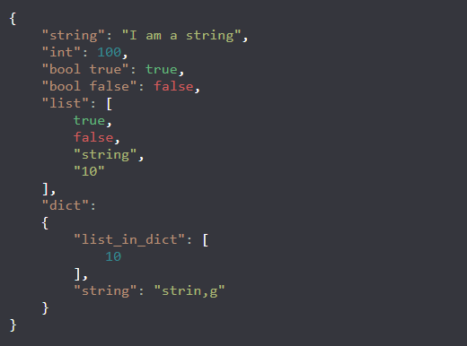

# jsonViewer
View JSON files on a website

## Installation + Setup
```bash
pip3 install Flask json
git clone https://github.com/champmq/jsonViewer.git
cd jsonViewer
python3 jsonViewer.py
```
To change the colors edit the values in config.json


## HowTo
Its based on an RestAPI which means you have to start it first with:
```bash
python3 jsonView.py
```

### Request format:
localhost:port/json_content <br>

### Output:
The output is just a text because JSON would parse it wrong so for example (python)
```python
import requests
import urllib.parse

req = requests.get("http://127.0.0.1:5000/" + urllib.parse.quote("JSON_CONTENT"))
print(req.text)
```
<br>

### Image

 <br>
background-color: #35363d


## Credits

Thanks to @HimmelKreis4865 for choosing the colours.